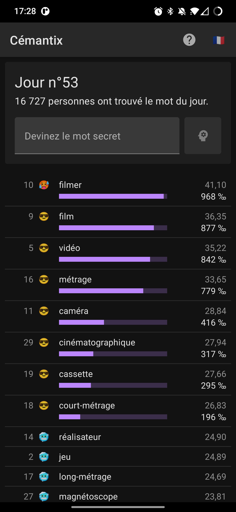
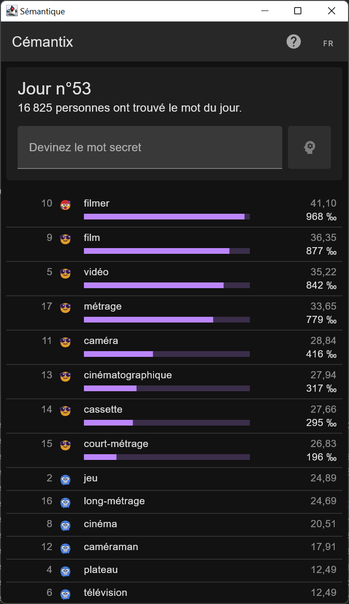

# Sémantique

This project is a Compose-based frontend for the [Cémantix website](https://cemantix.herokuapp.com/).

It uses its APIs and all credit goes to [enigmatix](https://twitter.com/enigmathix) for it.

## Screenshots

<table>
<tr>
<td></td>
<td></td>
</tr>
</table>
